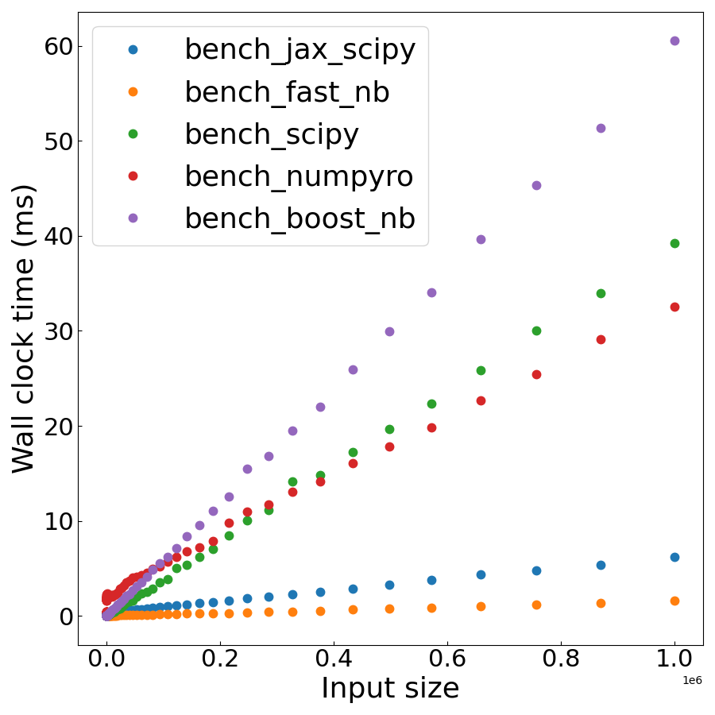

# Fast negative-binomial distribution

A fast negative-binomial distribution for Python and C++, optimised for small repeated integer counts such as those seen in single-cell RNA sequencing data.

Usage
=====

In Python, two versions of the negative-binomial distribution are given, each of which accept either scalar or vector (e.g., `np.array`) of integer valued observations observations. The vector functions are parallelised using OpenMP, so be sure to set `OMP_NUM_THREADS` to a reasonable value.

```bash
export OMP_NUM_THREADS=4
```

The first function is formulated as the number of failures `r`, and number of successes `k`, with probability of success `p`,

$$ f(k;r,p) = \binom{k+r - 1}{k}(1 - p)^kp^r $$

This is given by the function `fast_negative_binomial.negative_binomial`. This is a drop-in replacement of the `scipy.stats.nbinom.pmf` function.

```python
from fast_negative_binomial import negative_binomial

p = 0.1
r = 10
ks = np.array([3, 7, 1, 0, 1])

nb = negative_binomial(ks, r, p)
```

The second function is known as 'nb2' in statisical packages such as [NumPyro](https://num.pyro.ai/en/stable/distributions.html#negativebinomial2), and represents the distribution in terms of the mean of the `m` and concentration `r`, where

$$ p = \frac{r}{r + m}$$

This follows the same argument ordering as the NumPyro function (notably, reversing the last two arguments, with the same `r`),

```python
from fast_negative_binomial import negative_binomial2

m = 10
r = 10
ks = np.array([3, 7, 1, 0, 1])

nb = negative_binomial2(ks, m, r)
```

To avoid unncessary copies, these functions sort the vector of observations in place. If this is a problem, make a copy beforehand.

Performance
====



Run time comparison on an M3 Pro, with `OMP_NUM_THREADS=8`. This is an average over 100 runs, so that the high startup costs of the JAX JIT compilation is amortized.

Installation
=====

For Python, install from PyPi using pip:

```bash
pip install fast_negative_binomial
```

or, using the [latest wheel](https://github.com/dpohanlon/fast_nb/releases) for your platform from GitHub:

```bash
pip install fast_negative_binomial-0.1.0-cp310-cp310-macosx_11_0_arm64.whl
```

or, to install from source, see below.

Building
========

This is the best way to ensure that the package uses as many features of your CPU as possible, as the pre-built libraries are built assuming generic CPU architectures.

When building from source, this package requires CMake, Boost, Eigen, OpenMP, and PyBind11. PyBind11 is included with the package, however the rest are best installed using the package manager for your system. On Mac these can be installed using `brew`:

```bash
brew install cmake
brew install eigen
brew install libomp
brew install boost
```

and OpenMP requires the path to be set:

``` bash
export OpenMP_ROOT=$(brew --prefix)/opt/libomp
```

On Ubuntu, these can be installed using `apt-get`:

```bash
sudo apt-get install cmake
sudo apt-get install python3-dev
sudo apt-get install libboost-all-dev
sudo apt-get install libeigen3-dev

```

To checkout the repository, as well as the PyBind11 submodule:

``` bash

git clone --recurse-submodules git@github.com:dpohanlon/fast_nb.git
cd fast_nb
```

C++
---

To build the C++ library, you can build with CMake:

```bash
mkdir build
cd build
cmake ../
make -j4
```

and to build with the optional benchmarks (requires Google Benchmarks), configure cmake with the argument `-DENABLE_BENCHMARK=true`:

```bash
cmake ../ -DENABLE_BENCHMARK=true
```

Python
-----

With the repository checked out, build using pip:

```bash
pip install .
```

Contributing
-------

If you've made modifications, reformat with `clang-format`:

```bash
clang-format -i -style=file fast_negative_binomial/*
```

Optimisations
=============

Above a certain length of `k` where the overhead of spawning threads is worthwhile, caluculations are done in parallel over `OMP_NUM_THREADS`. The value of `r` is cached and used over all iterations, and (where `constexpr` math is supported) small combinations of `k` and `r` are pre-computed at compile time. There are also two further optimisations that either cache the return value of the function, or cache the value of log gamma:

Caching the return
-------

As `k` is always an integer, sorting the array a head of time allows us to cache the previous result, to be used if the next value of `k` is the same. This is particularly useful for the case of single cell RNA sequencing data, where numerous small counts are repeated.

Caching log gamma
-------

There is also a further optimisation that can be made by using the identity $\log \Gamma (x) = \log \Gamma (x - 1) + \log (x)$. If we know the value of $\log \Gamma (x - 1)$ we can compute $\log \Gamma (x)$ at the cost only of a call to $\log(x)$ rather than the more expensive $\log \Gamma (x)$. To attempt this optimisation as often as possible, we process these in order of increasing k, keeping track of the value of k and the corresponding value of $\log \Gamma (x)$. This has the advantage that we only need to cache two values (per thread), rather than a larger lookup table, and we can also compute repeated values in constant time.

Even in regions where there is a gap between the current k and the previous k, due to the expense of calling log gamma, it may still be faster to make repeated calls to $\log (k - 1)$, $\log (k - 2)$, etc.

Fixed size Eigen arrays
-------

Computation on fixed size Eigen arrays is preferable, as these are allocated on the stack, and can have SIMD, inlining, and loop unrolling optimisations applied. We can still leverage some of this advantage by constructing a fixed size `Eigen::Array`, and using the `Eigen::Map` constructor to convert to this from a subset of the larger dynamic array. These can be spread over threads, such that each has its own separate fixed size array. For the 'remainder' that is not an integer multiple of the fixed array size, this is calculated as normal (and therefore there is an additional overhead for these). In future we could also consider multiple fixed size arrays, and choose these dynamically depending on the workload.
